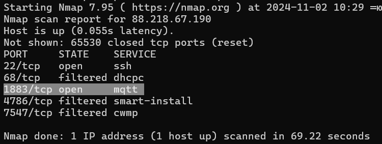
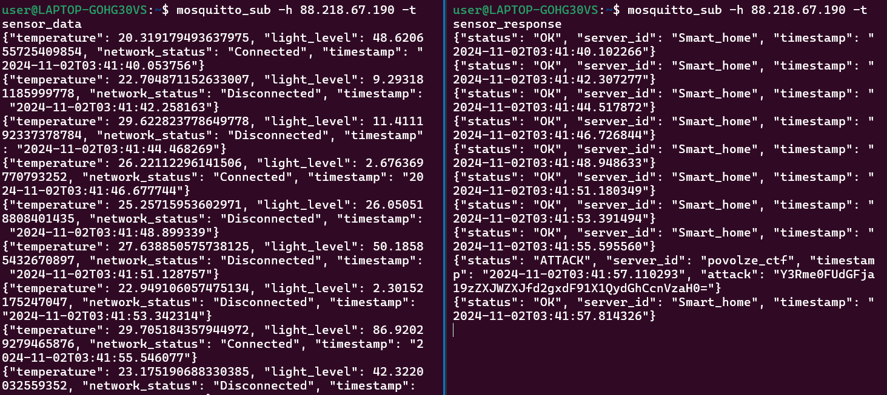

# BotNet | medium | forensic

## Информация

> Мы заметили, что наш умный дом начал работать некорректно. 
> Что происходит, нет времени, держи бинарь.
>
> P.S. Нам удалось выяснить, что это ESP32.

## Деплой

```sh
cd deploy
docker compose up --build -d
```
!сервер для [брокера](https://pikabu.ru/story/besplatnyiy_i_lichnyiy_mqtt_broker_mosquitto_dlya_iotustroystv_na_bazeubuntu_2004_na_always_free_vps_serverot_oracle_7982336) запускает автор задания [d1temnd](https://t.me/d1temnd) 

## Выдать участинкам

Содержимое директории [public/](public/)

## Hint
если есть ip адрес значит есть и открытые порты, возможно нужно проверить все 


## Описание

Нужно декомпилировать бинарный файл, там найти данные для подключения к MQTT серверу. В топик, который используется для обратного общения с ESP32, иногда (раз в минуту) прилетает JSON словарь со статусом **ATTACK**, в значении **ATTACK_STRING** приходит флаг, зашифрованный в base64.


## Решение

Вводные данные: бинарник. 

Попробуем его декомпилировать в IDA. Загружаем и по умолчанию выбираем параметры.


Мы знаем, что это ESP, значит она подключается к какой-то сети и к какому-то серверу. Попробуем поизучать декомпилированный код и поискать похожие строки, что-нибудь похожее на **ip server**.

Находим строку **ip server** и переходим на нее. 

Видим, что он пытается куда-то подключиться. Давайте посмотрим, куда он ссылается.

Находим IP-адрес для подключения куда-то, а также находим какие-то топики, которые называются **sensor_data** и **sensor_response**. Запомним их на всякий случай и пойдем сканить IP на наличие открытых портов.

Видим два открытых порта — **22 (SSH)** и **1883 (MQTT сервер)**. Гуглим, как подключиться к нему.
Это можно сделать одной командой.
```sh
mosquitto_sub -h 158.160.74.201 -t sensor_data
```
Это мы подключились к одному топику, а у нас есть еще и второй. Подключаемся и к нему тоже. 
```sh
mosquitto_sub -h 158.160.74.201 -t sensor_response
```

Видим, что идут какие-то пакеты: устройство отправляет и получает обратный ответ от сервера. 
Если посмотреть чуть дольше, можно увидеть, что проходит какой-то странный пакет на сервер со статусом **ATTACK**. 
И если посмотреть ключ **attack**, то мы увидим какую-то строчку, напоминающую **base64**.

Декодируем её и получаем флаг.

## Флаг

`ctf{ATtack_serVer_wh1t_u_T2thBrush}`

