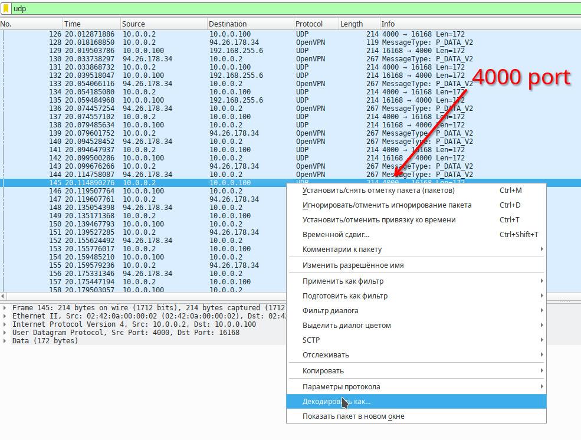
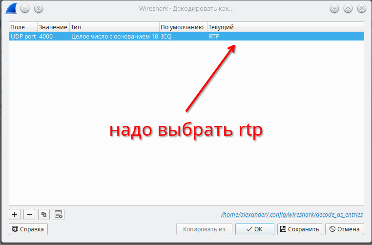
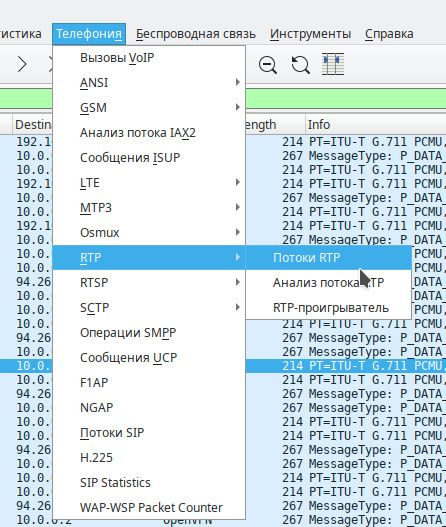
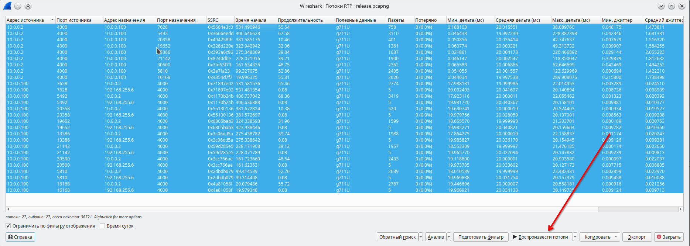
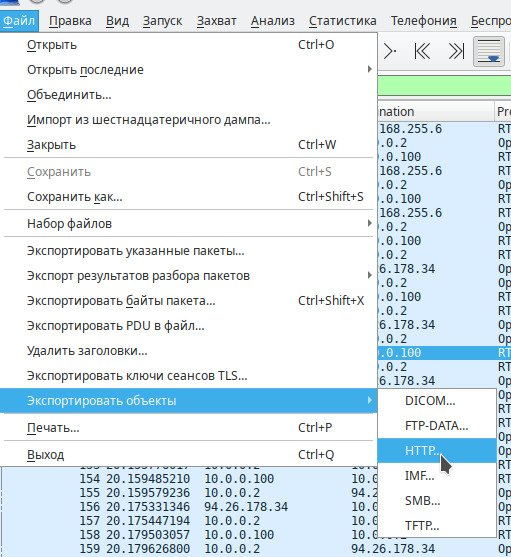

# OfficeTraffic | hard | forensics

## Информация
> Нами был захвачен сетевой трафик офиса. Разузнайте их секреты!

## Деплой
Необходимо открыть порт `1194` на **UDP** протокол.
```
cd deploy
sudo ./deploy.sh
```
!В случае неудачи деплоя (программа в конце напишет: `Error, Restart deploy!!!`) перезапустить ./deploy.sh и согласиться на смену ключей/конфига (предложат ввести `yes` - надо ввести `yes`). Пока не напишет `Success!` и запустит docker.

## Выдать участинкам
Выдавать только после **Деплоя**!
файл [release.pcapng](public/release.pcapng)

## Подсказка 1
> Густой трафик напоминает звонки

## Подсказка 2
> Возможно стоит обратиться в центр подготовки

## Описание
Нужно udp запросы с порта 4000 декодировать как rtp пакеты в wireshark. Затем из разговоров узнать имя и пароль для входа в voip сеть. Заметить, что был захвачен файл certificate.ovpn и подключиться к сети, затем позвонить по номеру 1337 и получить флаг.

## Решение
### Анализ RTP:
Нужно udp запросы с порта 4000 декодировать как rtp пакеты в wireshark:




Затем просмотреть потоки RTP:



Затем воспроизвести потоки RTP:



Внимательно послушать, если вылетает, то можно выделить не все потоки и перейти снова к этому шагу:


### Разговоры
Далее в скобках будут писаться задуманные роли персонажей.

- Из разговора 3 (Зам директора - Сисадмин) узнать имя и пароль для входа в voip сеть: `логин: 2835; пароль: strong`
- Из разговора 7 (Сисадмин - Бухгалтер) узнать адрес где можно получить некоторый ключ: `1337`
- Из разговора 8 (Сисадмин - Центр Подготовки) узнать ключ: `noctf{secret_key}`. Но очевидно, что это не тот, что нам нужен.

### Дамп конфигурационного файла openvpn
Надо осмотреть дамп сети в wireshark заново и найти, что был захвачен по http файл certificate.ovpn:



После подключения к сети по этому конфигурационному файлу мы оказываемся в сети VOIP телефонии из дампа. Используя известный логин и любой, поддерживающий TLS подключение к SIP, клиент VOIP, позвонить по номеру `1337` и получить флаг.

## Флаг
`ctf{51p_7r4ff1c}`
