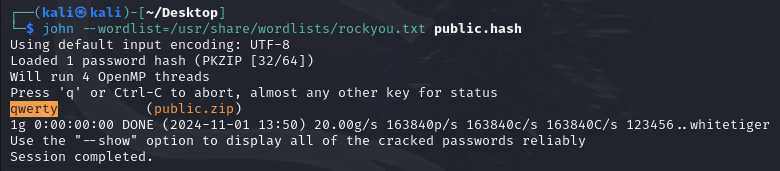
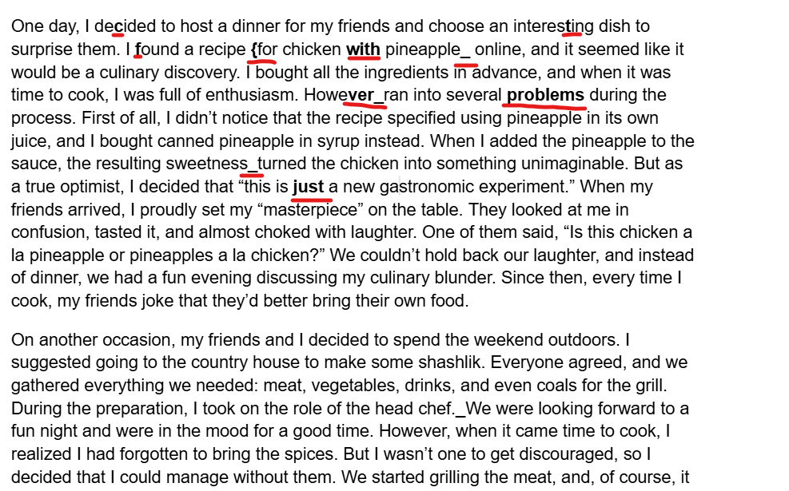

# вроде ворд | easy | forensic

## Информация

> На компьютере подозреваемого был найден ворд-файл, но нам не удалось его открыть. Может, ты попробуешь? 
> 

## Выдать участинкам

содержимое директории [public/](public/)

## Описание

Нужно перевести Word в zip, сломать пароль на нем с помощью стандартного словаря **rockyou.txt**, затем переархивировать без пароля и поменять расширение обратно на docx. В файле жирным выделены буквы и слова, если их собрать, получится флаг.

## Решение

Пробуем открыть файл и получаем ошибку.

Вспоминаем, что **docx** на самом деле является **zip** файлом, и меняем расширение на .zip.

Пробуем открыть его, и он у нас запрашивает пароль. Используем утилиту **zip2john** и получаем хэш.
`zip2john public.zip > public.hash`,
уже с помощью утилиты **john** крякаем этот хэш с применением стандартного словаря **rockyou.txt**.
`john --wordlist=/usr/share/wordlists/rockyou.txt public.hash`
Получаем пароль **qwerty**.

Применяем этот пароль к нашему архиву и достаем содержимое. Теперь нужно его переархивировать без пароля обратно в zip и изменить расширение на **.docx**.

Открываем этот документ и видим, что какие-то буквы более жирные, чем другие.

Проходимся по всему тексту и собираем флаг.

## Флаг

`ctf{with_ver_problems_just_today_one_friends}`

