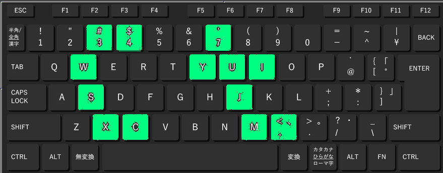

# mics | Искусство | easy

## Информация
> Был я как-то на одной выставке соверменного искусства. Очень и очень интересные картины, но я вот честно вообще не понял одну. Может ты мне поможешь понять, что хотел сказать автор?

## Деплой
Не требуется

## Выдать участникам
Содержимое [папки](public/)

## Описание
Если закрасить комбинации клавиш, то получаются буквы

## Решение
Все просто, раскасить комбинацию символом, то получаются буквы, из которых и состоит флаг. Вот пример первых двух:

Вырисовываются очевидным образом буквы `ct`
## Флаг

`ctf{modern}`
